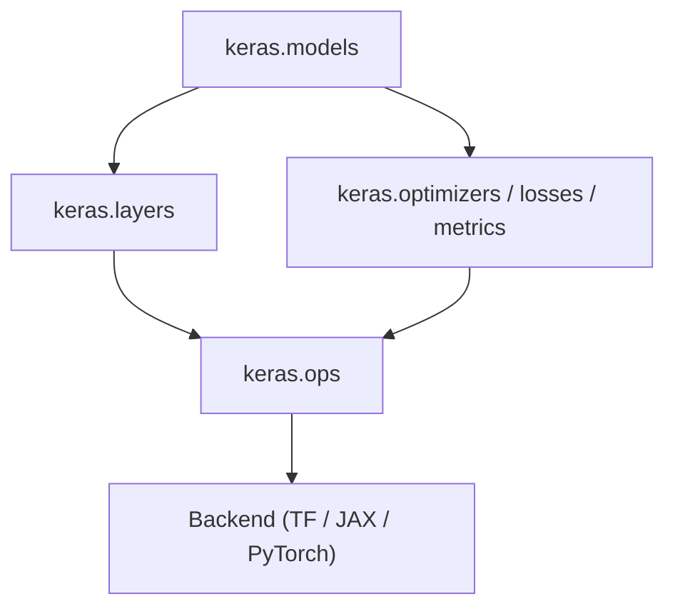
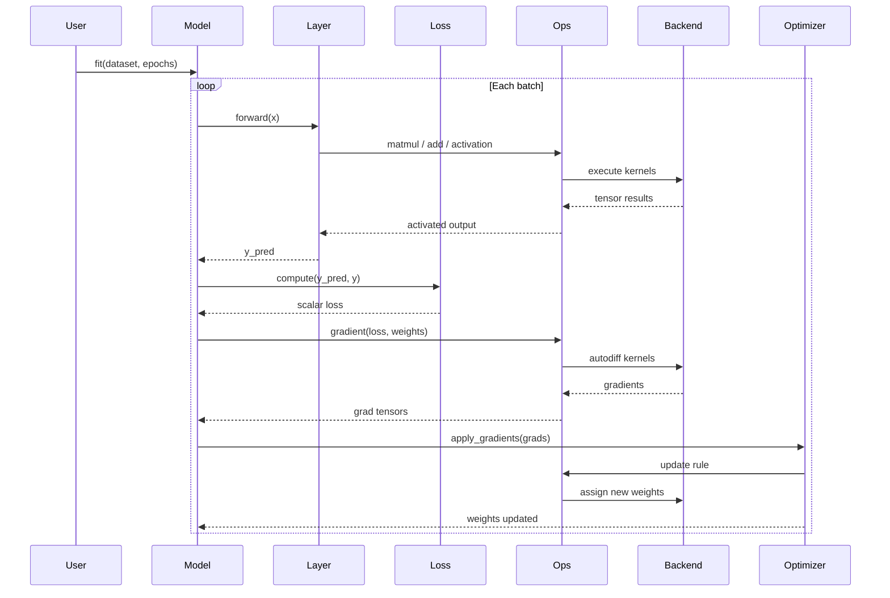
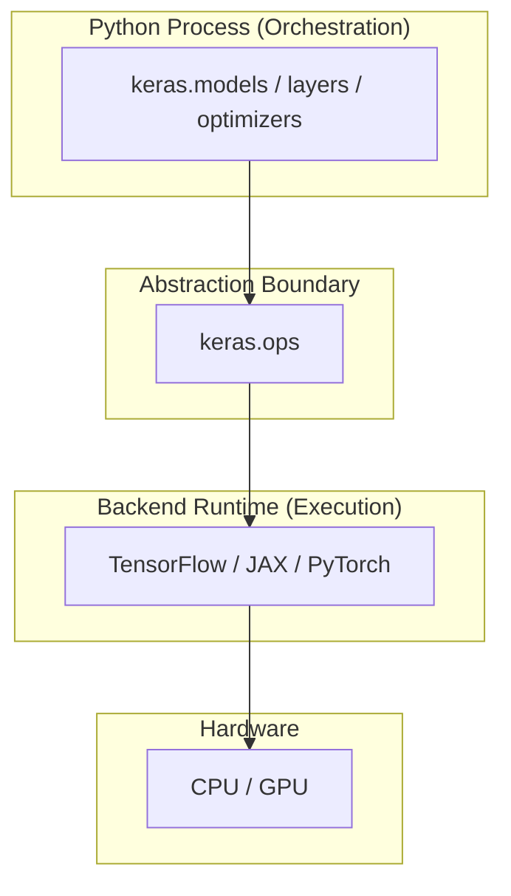

# ARCHITECTURE.md — Keras 3 Architecture Recovery

This document presents the complete recovered software architecture of Keras 3.
It is the primary deliverable of this project and the single canonical reference
for all architectural claims.

**Textbook reference:** Bass, Clements, Kazman — *Software Architecture in Practice*, 3rd Ed.

---

## 1. Definition of Software Architecture Applied Here

> "The software architecture of a system is the set of structures needed to reason
> about the system, which comprise software elements, the relations among them,
> and properties of both."
> — Bass, Clements, Kazman, Ch.1

Applied to this project: the architecture of Keras is the set of three complementary
structures — Module, C&C, and Allocation — that together allow us to reason about
how Keras achieves its key quality attributes: **modifiability**, **portability**,
and **maintainability**.

No single view captures all concerns. All three are required.

---

## 2. This Project's Own Architecture

This project is itself a Pipe-and-Filter pipeline. Understanding its structure
helps a reader navigate to any artifact in under two minutes.

```
experiments/   ->   views/   ->   findings/   ->   ARCHITECTURE.md
(observe Keras)   (represent)   (synthesize)    (canonical document)
```

| Folder | Role in the pipeline | Question answered |
|---|---|---|
| `experiments/` | Generate empirical evidence | What does Keras actually do at runtime? |
| `views/` | Represent recovered structures | What does the architecture look like? |
| `findings/` | Synthesize analysis | What does it mean and why does it matter? |
| `docs/` | Context and methodology | Why this project, how was it conducted? |
| `vendor/keras/` | Subject under study | The Keras 3 source code (read-only) |

Run `python main.py` to execute the full evidence pipeline and validate all
architectural claims empirically.

---

## 3. Recovered Architecture of Keras 3

### 3.1 Module View — Static Dependency Structure

This view shows how Keras is statically decomposed and how modules depend on each other.



**Primary dependency chain:**
```
keras.models  ->  keras.layers  ->  keras.ops  ->  Backend
```

`keras.ops` is the **abstraction boundary**: everything above it is backend-agnostic;
everything below it is backend-specific. This boundary is the central architectural
decision in Keras.

**Subsystem responsibilities:**

| Subsystem | Responsibility |
|---|---|
| `keras.models` | Orchestrates layer topology and training lifecycle |
| `keras.layers` | Defines atomic, reusable transformation units |
| `keras.optimizers / losses / metrics` | Implements the adaptive feedback control subsystem |
| `keras.ops` | Routes all tensor operations to the active backend |
| Backend (TF / JAX / PyTorch) | Executes tensor math, autodiff, and hardware dispatch |

**Architectural tactics applied:**
- *Restrict dependencies* — no layer module may import a backend directly
- *Encapsulate* — `keras.ops` hides all backend dispatch behind a stable API
- *Use an intermediary* — `keras.ops` sits between layers and backends

Full detail: [views/module-view.md](views/module-view.md)
Component definitions: [findings/components.md](findings/components.md)

---

### 3.2 Component-and-Connector View — Runtime Training Pipeline

This view shows how Keras components interact at runtime during one training iteration.



**Runtime observations:**
- Training is a stateful iterative feedback loop, not a single function call
- `Model` coordinates all phases but performs no tensor computation itself
- Every numerical operation passes through `keras.ops` → Backend
- The connector topology (call sequence) is identical across all backends

**Architectural patterns in this view:**

| Pattern | Where |
|---|---|
| Pipeline | Stages execute in fixed order: forward → loss → backward → update |
| Feedback Control Loop | Loss drives weight update which affects next forward pass |
| Delegation | Layer / Loss / Optimizer delegate all computation to Backend via ops |

Full detail: [views/cnc-view.md](views/cnc-view.md)

---

### 3.3 Allocation View — Execution Environment Mapping

This view maps each software element to the runtime tier where it executes.



**Three-tier allocation:**

```
Tier 1 — Python Orchestration
   keras.models, keras.layers, keras.optimizers
   Control flow; no numerical computation; hardware-agnostic

Tier 2 — Abstraction Boundary
   keras.ops — the single crossing point between Python and the backend

Tier 3 — Backend Execution
   TensorFlow / JAX / PyTorch -> CPU / GPU
   All tensor math, autodiff, and memory management
```

**Key allocation decision:** The backend is bound at runtime via `KERAS_BACKEND`,
not at code-compile time. This is a late-binding decision that enables portability
without source code changes.

Full detail: [views/allocation-view.md](views/allocation-view.md)

---

## 4. Quality Attribute Scenarios

Three formal scenarios using the six-part Bass et al. template (Ch.4):

| # | Quality attribute | Scenario summary | Response measure |
|---|---|---|---|
| 1 | Modifiability | Add a new compute backend (WebGPU) | < 5 files outside `keras/backend/` modified; all existing tests pass |
| 2 | Portability | Migrate production model from TensorFlow to JAX | Zero lines of model/training code modified; only `KERAS_BACKEND` changed |
| 3 | Testability | Validate gradient delegation claim experimentally | Experiment runs in < 5 seconds; all weights updated; zero backend imports in source |

Full scenarios with all six parts: [findings/qa-scenarios.md](findings/qa-scenarios.md)

---

## 5. Design Decisions — Seven-Category Mapping (Bass et al., Ch.4)

| Category | Keras decision |
|---|---|
| Allocation of responsibilities | One responsibility per level in the chain; ops dispatches only |
| Coordination model | Synchronous call-and-return; tensor dataflow; no shared mutable state |
| Data model | Tensor is the universal data abstraction; all subsystem boundaries exchange tensors |
| Management of resources | Backend owns weight memory; backend is immutable after process start |
| Mapping among elements | `model.fit()` maps to a batch loop; `ops.matmul` maps to a kernel invocation |
| Binding time | Backend bound at runtime (env var); optimizer bound after `compile()`; layer types at design time |
| Choice of technology | Python for orchestration; `keras.ops` as backend-neutral API; env var for backend selection |

Full mapping with rationale: [findings/design-decisions.md](findings/design-decisions.md)

---

## 6. Architectural Patterns

| Pattern | Where in Keras | Primary quality attribute |
|---|---|---|
| Layered Architecture | `models → layers → ops → backend` | Modifiability |
| Pipe-and-Filter | Training pipeline stages | Testability |
| Feedback Control Loop | Training loop per batch | Performance |
| Bridge | `keras.ops` ↔ backend | Portability |
| Strategy | Optimizers, losses, backends | Modifiability |
| Composite | Model composes Layers | Reusability |

Full catalog with evidence: [findings/patterns.md](findings/patterns.md)

---

## 7. Evidence Traceability

Every architectural claim in this document is grounded in at least one runnable experiment.

| Architectural claim | Experiment | What the output shows |
|---|---|---|
| Keras decomposes into focused subsystems | `exp01_module_scan.py` | Lists all top-level packages; traces class origins |
| Model → Layer → ops delegation chain | `exp02_forward_trace.py` | Prints execution order and shapes through DebugLayer |
| Training is an iterative feedback loop | `exp03_training_step.py` | Per-batch loss logged via callback |
| Gradient computation delegated to backend | `exp04_gradient_flow.py` | Weights updated; no backend import in source |
| Same model runs on any backend | `exp05_backend_switching.py` | Identical code runs with `KERAS_BACKEND=tensorflow|jax|torch` |
| `keras.ops` routes to active backend | `exp06_backend_delegation.py` | ops.matmul produces backend-typed tensor transparently |

Run all experiments: `python main.py`

---

## 8. Recovery Methodology

The architecture was recovered using three complementary techniques:

1. **Static analysis** — `pkgutil.iter_modules()` and `inspect.getmodule()` reveal package boundaries and dependency origins
2. **Dynamic tracing** — custom `DebugLayer` subclasses and `BatchLogger` callbacks make runtime execution order observable
3. **Behavioural validation** — backend switching and direct `ops.*` calls confirm that abstraction boundaries hold functionally, not just conceptually

Methodology details: [docs/methodology.md](docs/methodology.md)
