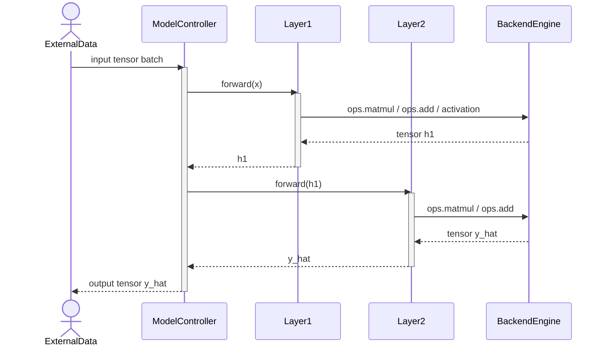

# Week 1 — Component & Connector View (Runtime Forward Flow)

```mermaid
sequenceDiagram
    actor ExternalData
    participant ModelController
    participant Layer1
    participant Layer2
    participant BackendEngine

    ExternalData->>ModelController: input tensor batch
    activate ModelController

    ModelController->>Layer1: forward(x)
    activate Layer1
    Layer1->>BackendEngine: ops.matmul / ops.add / activation
    BackendEngine-->>Layer1: tensor h1
    Layer1-->>ModelController: h1
    deactivate Layer1

    ModelController->>Layer2: forward(h1)
    activate Layer2
    Layer2->>BackendEngine: ops.matmul / ops.add
    BackendEngine-->>Layer2: tensor y_hat
    Layer2-->>ModelController: y_hat
    deactivate Layer2

    ModelController-->>ExternalData: output tensor y_hat
    deactivate ModelController
```

Format: Mermaid
