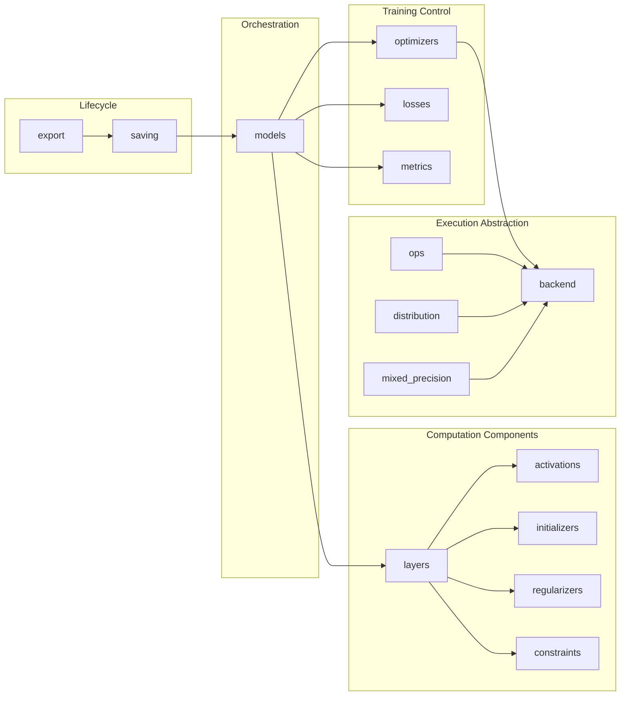

# Week 1 — Module Decomposition (Specialization)

```mermaid
graph LR
    subgraph Orchestration
        models[models]
    end

    subgraph "Computation Components"
        layers[layers]
        activations[activations]
        initializers[initializers]
        regularizers[regularizers]
        constraints[constraints]
    end

    subgraph "Training Control"
        optimizers[optimizers]
        losses[losses]
        metrics[metrics]
    end

    subgraph "Execution Abstraction"
        backend[backend]
        ops[ops]
        distribution[distribution]
        mixed_precision[mixed_precision]
    end

    subgraph Lifecycle
        saving[saving]
        export[export]
    end

    models --> layers
    models --> optimizers
    models --> losses
    models --> metrics

    layers --> activations
    layers --> initializers
    layers --> regularizers
    layers --> constraints

    optimizers --> backend
    ops --> backend
    distribution --> backend
    mixed_precision --> backend

    saving --> models
    export --> saving
```

Format: Mermaid
