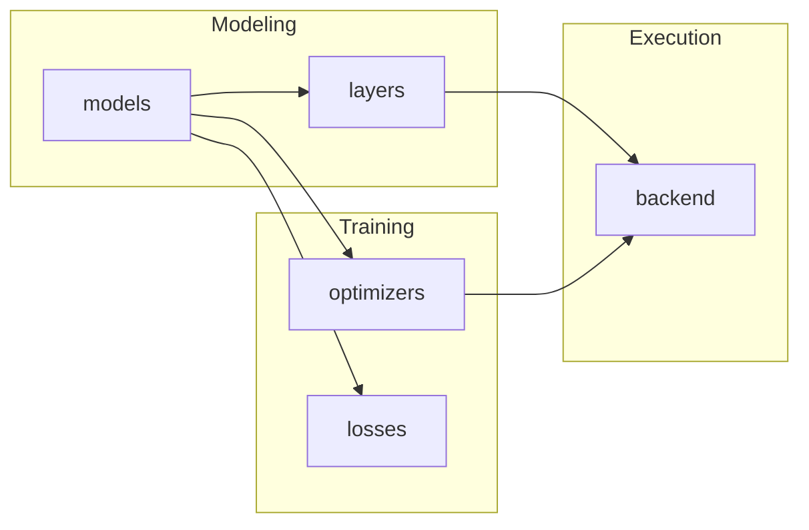

# Week 1 — Module View (Static)

```mermaid
graph LR
    subgraph Modeling
        models[models]
        layers[layers]
    end

    subgraph Training
        optimizers[optimizers]
        losses[losses]
    end

    subgraph Execution
        backend[backend]
    end

    models --> layers
    models --> optimizers
    models --> losses
    layers --> backend
    optimizers --> backend
```

Format: Mermaid
