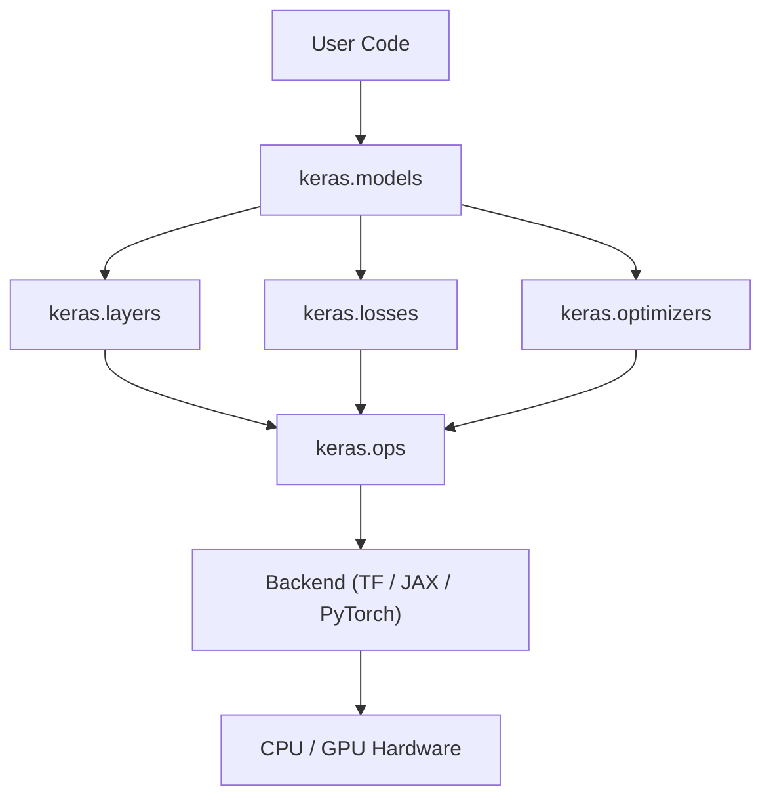

# Component Registry

This file defines every named architectural component recovered from Keras 3.
Each entry specifies the component's responsibility, its position in each view,
the quality attributes it supports, and the experiments that provide evidence.

Reference: Bass, Clements, Kazman — *Software Architecture in Practice*, Ch.1

---

## Component: keras.models (Model / Sequential / Functional)

| Property | Value |
|---|---|
| **Type** | Module (static) / Orchestrator (runtime) |
| **Responsibility** | Coordinates the full training and inference lifecycle; owns the execution sequence |
| **Module position** | Top of the dependency chain — uses `keras.layers` and training components |
| **Runtime role** | Calls `Layer.call()`, coordinates loss, gradients, and optimizer; never performs tensor math |
| **Allocation** | Python process |
| **Dependencies** | `keras.layers`, `keras.optimizers`, `keras.losses`, `keras.metrics` |
| **Depended on by** | User code |
| **Quality attributes** | Modifiability, Integrability, Analyzability |
| **Patterns** | Composite (organises layers), Orchestrator |
| **Evidence** | `exp02_forward_trace.py`, `exp03_training_step.py` |

---

## Component: keras.layers (Layer)

| Property | Value |
|---|---|
| **Type** | Module (static) / Component (runtime) |
| **Responsibility** | Defines atomic, reusable transformation units; encapsulates weights and forward logic |
| **Module position** | Mid-chain — uses `keras.ops`; used by `keras.models` |
| **Runtime role** | Applies learned transformation to input tensor via `call(inputs)` |
| **Allocation** | Python process |
| **Dependencies** | `keras.ops` |
| **Depended on by** | `keras.models` |
| **Quality attributes** | Reusability, Modifiability, Testability |
| **Patterns** | Strategy (interchangeable layer types), Composite (nested layers) |
| **Evidence** | `exp02_forward_trace.py` |

---

## Component: keras.ops (Unified Operator API)

| Property | Value |
|---|---|
| **Type** | Module (static) / Intermediary (runtime) |
| **Responsibility** | Backend-neutral operator interface; routes all tensor operations to the active backend |
| **Module position** | The abstraction boundary — everything above is backend-agnostic; below is backend-specific |
| **Runtime role** | Translates unified API calls (`ops.matmul`, `ops.relu`) into backend-specific kernels |
| **Allocation** | Python process (dispatch) → Backend runtime (execution) |
| **Dependencies** | Active backend (TF / JAX / PyTorch) |
| **Depended on by** | `keras.layers`, `keras.losses`, `keras.optimizers` |
| **Quality attributes** | Portability, Replaceability, Modifiability |
| **Patterns** | Bridge (decouples abstraction from implementation), Use an Intermediary tactic |
| **Evidence** | `exp06_backend_delegation.py`, `exp05_backend_switching.py` |

---

## Component: Backend (TensorFlow / JAX / PyTorch)

| Property | Value |
|---|---|
| **Type** | External runtime / Execution engine |
| **Responsibility** | Executes all tensor operations; manages memory; runs autodiff; dispatches to hardware |
| **Module position** | Bottom of the dependency chain — depended on by `keras.ops` only |
| **Runtime role** | Performs forward kernels, gradient computation, and weight assignment |
| **Allocation** | Native runtime (C++ / XLA / CUDA) on CPU or GPU |
| **Dependencies** | Hardware (CPU / GPU) |
| **Depended on by** | `keras.ops` only |
| **Quality attributes** | Performance, Scalability |
| **Patterns** | Strategy (backends are interchangeable implementations of the same interface) |
| **Evidence** | `exp04_gradient_flow.py`, `exp05_backend_switching.py`, `exp06_backend_delegation.py` |

---

## Component: keras.optimizers (Optimizer)

| Property | Value |
|---|---|
| **Type** | Module (static) / Component (runtime) |
| **Responsibility** | Applies gradient updates to model weights according to a learning algorithm |
| **Module position** | Parallel to `keras.layers` under `keras.models`; uses `keras.ops` |
| **Runtime role** | Receives gradient tensors; applies update rule; writes new weight values via ops |
| **Allocation** | Python process (algorithm) → ops/backend (weight assignment) |
| **Dependencies** | `keras.ops` |
| **Depended on by** | `keras.models` |
| **Quality attributes** | Testability, Evolvability |
| **Patterns** | Strategy (SGD, Adam, RMSprop are interchangeable strategies) |
| **Evidence** | `exp04_gradient_flow.py` |

---

## Component: keras.losses (Loss)

| Property | Value |
|---|---|
| **Type** | Module (static) / Component (runtime) |
| **Responsibility** | Computes a scalar error signal from predictions and targets |
| **Module position** | Parallel to `keras.layers`; uses `keras.ops` |
| **Runtime role** | Produces the scalar loss tensor that initiates backpropagation |
| **Allocation** | Python process → ops/backend |
| **Dependencies** | `keras.ops` |
| **Depended on by** | `keras.models` |
| **Quality attributes** | Testability, Modifiability |
| **Patterns** | Strategy (MSE, CrossEntropy are interchangeable loss strategies) |
| **Evidence** | `exp03_training_step.py` |

---

## Dependency Summary

`keras.ops` is the abstraction boundary — everything above it is backend-agnostic; everything below is backend-specific.
