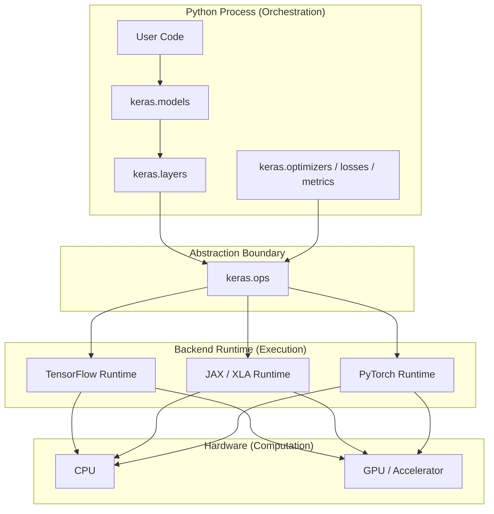

# Allocation View — Execution Environment Mapping

This view maps Keras software elements to the runtime environments and hardware
resources where they actually execute. It answers the question: **where does each
part of the system actually run?**

Reference: Bass, Clements, Kazman — *Software Architecture in Practice*, Ch.1 (Allocation Structures)

---

## Allocation Diagram



Only one backend is active at a time (selected by `KERAS_BACKEND`). The diagram shows
all three to illustrate that the allocation decision is deferred to runtime.

---

## Allocation Table

| Software Element | Runs Where | Responsibility at That Level |
|---|---|---|
| User code, `keras.models`, `keras.layers` | Python process (CPU) | Control flow, topology, orchestration |
| `keras.optimizers`, `keras.losses`, `keras.metrics` | Python process (CPU) | Training configuration and feedback signals |
| `keras.ops` | Python process — acts as dispatch bridge | Routes operations to the active backend |
| Backend runtime (TF / JAX / PyTorch) | Native runtime (C++ / XLA / CUDA) | Tensor operation execution, autodiff, memory |
| Tensor operations | CPU or GPU hardware | Numerical matrix computation |

---

## Three-Tier Structure

```
Tier 1 — Python Orchestration
   keras.models, keras.layers, keras.optimizers, keras.losses
   Runs in Python; controls execution order; hardware-agnostic

Tier 2 — Abstraction Boundary
   keras.ops
   The single crossing point between Python and the backend

Tier 3 — Backend Execution
   TensorFlow / JAX / PyTorch -> CPU / GPU
   Performs all numerical computation; invisible to tiers above
```

---

## Architectural Properties

**Control is separated from execution.**
Python orchestrates the training sequence. The backend executes tensor operations.
This separation means Python code never blocks on hardware-specific details and the
backend can be optimised independently of the model structure.

**Late binding of the backend.**
The active backend is selected at process startup via the `KERAS_BACKEND` environment
variable. No model code contains a compile-time binding to TensorFlow, JAX, or PyTorch.
This is a **late binding** design decision (deferred allocation) that maximises portability.

**Hardware abstraction.**
GPU acceleration, mixed-precision execution, and distributed training are handled
entirely within the backend tier. The Python tier has no knowledge of physical devices.
`keras.ops` is the boundary at which hardware concerns begin.

---

## Allocation Decisions and Their Impact

| Decision | Consequence |
|---|---|
| Model and Layer run in Python | Easy to debug, inspect, and extend with pure Python code |
| All tensor math allocated to backend | Backend can apply hardware-specific optimisations (XLA, CUDA) |
| `keras.ops` as the sole crossing point | Changing the backend requires no changes above the ops layer |
| Backend selected via environment variable | Same code runs on TF, JAX, or PyTorch without source changes |
| Hardware (CPU/GPU) selected by backend | User code is completely decoupled from physical hardware |

---

## Why Allocation Matters for Quality Attributes

| Quality attribute | How allocation supports it |
|---|---|
| **Portability** | The abstraction boundary (`keras.ops`) ensures the Python tier is hardware-agnostic |
| **Performance** | Execution is allocated to the backend, which applies hardware-specific optimisations |
| **Modifiability** | A new backend can be added without touching any code in the Python orchestration tier |
| **Scalability** | Backend runtimes handle distributed execution; the model API is unchanged |

---

## Key Insight

> Only the backend runtime interacts directly with CPU/GPU execution paths.
> The Python orchestration tier remains hardware-agnostic throughout.
> This allocation boundary is what makes Keras portable across TensorFlow,
> JAX, and PyTorch without any change to user-facing model code.

---

## Evidence

| Claim | Validated by |
|---|---|
| Same model code runs on any backend | `experiments/exp05_backend_switching.py` |
| ops routes to backend transparently | `experiments/exp06_backend_delegation.py` |
| Backend is a runtime configuration | `experiments/exp05_backend_switching.py` (KERAS_BACKEND env var) |
