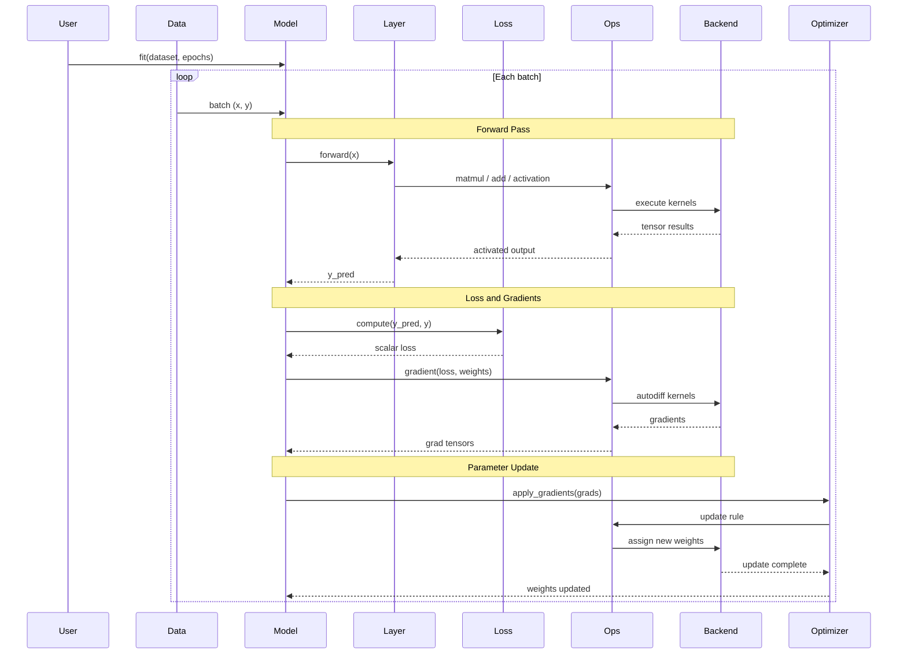

# Component-and-Connector View — Runtime Training Pipeline

This view shows how Keras components interact **at runtime** during one complete training
iteration. It answers the question: **who communicates with whom while the system runs,
and in what order?**

Reference: Bass, Clements, Kazman — *Software Architecture in Practice*, Ch.1 (C&C Structures)

---

## Runtime Training Sequence



---

## Components and Their Runtime Roles

| Component | Runtime Role | Entry Point |
|---|---|---|
| `Model` | Central orchestrator — coordinates all phases, holds state | `fit()`, `train_on_batch()` |
| `Layer` | Transformation unit — applies learned function to input tensor | `call(inputs)` |
| `Loss` | Error signal — computes scalar distance between prediction and target | `call(y_pred, y_true)` |
| `Optimizer` | Update rule — adjusts weights from gradient signals | `apply_gradients(grads)` |
| `keras.ops` | Dispatch intermediary — routes all operations to the active backend | `matmul()`, `relu()`, etc. |
| `Backend` | Execution engine — performs tensor math, autodiff, kernel dispatch | internal |

---

## Connector Types

Connectors are the runtime interactions that link components. In Keras three connector
types are present:

| Connector type | Example | Carries |
|---|---|---|
| Synchronous procedure call | `Model -> Layer.call(x)` | Control + input tensor |
| Tensor dataflow | `Backend -> Ops -> Layer` | Output tensor (activations, gradients) |
| Delegation call | `Ops -> Backend` | Operation + operands; returns result tensor |

The training pipeline is not a single function call — it is a sequence of these
connector types repeated once per batch.

---

## Data and Control Flow Paths

**Forward path** (prediction):
```
Data -> Model -> Layer -> Ops -> Backend -> Ops -> Layer -> Model
```

**Loss and gradient path** (error signal):
```
Model -> Loss -> Model -> Ops -> Backend -> Ops -> Model
```

**Update path** (learning):
```
Model -> Optimizer -> Ops -> Backend
```

All three paths converge on `keras.ops` → `Backend`. The backend is the sole
execution site; all other components orchestrate or transform but never compute raw
tensor math directly.

---

## Pipeline Phases

| Phase | Components active | Backend involvement |
|---|---|---|
| Forward pass | Model, Layer, Ops, Backend | Yes — kernel execution |
| Loss computation | Model, Loss, Ops, Backend | Yes — reduction ops |
| Gradient computation | Model, Ops, Backend | Yes — autodiff |
| Weight update | Model, Optimizer, Ops, Backend | Yes — assign ops |

---

## Architectural Properties

**Separation of orchestration and execution.**
`Model` coordinates the sequence of phases but never performs numerical computation.
All computation is delegated through `keras.ops` to the backend. If the backend is
replaced, `Model` code is completely unaffected.

**Iterative feedback loop.**
The training cycle is a stateful feedback loop: each iteration uses the loss from the
previous forward pass to update weights, which then affects the next forward pass.
This is a classic **Feedback Control Loop** pattern (Bass et al., Ch.13).

**Stable orchestration, variable execution.**
The connector sequence (the order of calls: forward → loss → backward → update) is
stable across all backends. What changes between backends is how each individual
operation is executed — not when or by whom it is called.

---

## Architectural Patterns

| Pattern | Where it appears |
|---|---|
| Pipeline | Stages execute in fixed order: forward → loss → backward → update |
| Feedback Control Loop | Loss signal drives weight update, which affects next forward pass |
| Delegation | Layer/Loss/Optimizer delegate all computation to Backend via ops |
| Command | Optimizer applies an update command: `apply_gradients(grads, vars)` |

---

## Key Insight

> Keras runtime behavior is a connector-driven training loop where orchestration
> remains in `Model` and numerical work is delegated through `keras.ops` to the
> backend engine. Swapping the backend changes the execution engine but leaves
> the connector topology — the architecture — completely unchanged.

---

## Evidence

| Claim | Validated by |
|---|---|
| Sequential layer execution order | `experiments/exp02_forward_trace.py` |
| Training as iterative feedback loop | `experiments/exp03_training_step.py` |
| Gradient computation delegated to backend | `experiments/exp04_gradient_flow.py` |
| keras.ops routes operations to backend | `experiments/exp06_backend_delegation.py` |
