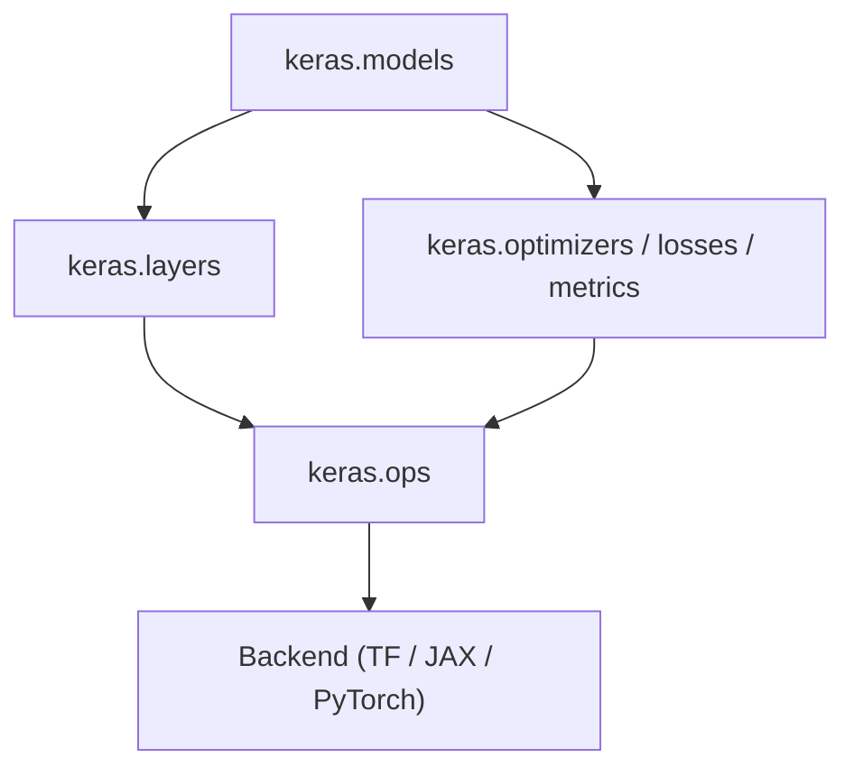

# Module View — Static Dependency Structure

This view shows how Keras is statically decomposed into modules and how those modules
depend on one another. It answers the question: **who depends on whom at design time?**

Reference: Bass, Clements, Kazman — *Software Architecture in Practice*, Ch.1 (Module Structures)

---

## Primary Dependency Chain



Arrows represent *uses* relationships: if A → B, then A depends on B to function.
Dependencies flow strictly downward. No upward or circular dependencies exist.

---

## Simplified Core Chain

Every tensor computation ultimately passes through this four-step chain:

```
keras.models  →  keras.layers  →  keras.ops  →  Backend
```

`keras.ops` is the **critical boundary**: everything above it is backend-agnostic;
everything below it is backend-specific.

---

## Subsystem Responsibilities

| Subsystem | Key Classes | Responsibility | Quality Attributes Supported |
|---|---|---|---|
| Model Composition | `Model`, `Sequential`, `Functional` | Orchestrates layer topology and training lifecycle | Modifiability, Integrability |
| Core Computation | `Dense`, `Conv2D`, `LSTM`, activations | Atomic reusable transformation units | Reusability, Modifiability |
| Training Control | `Adam`, `SGD`, `MSE`, `Accuracy`, `Callback` | Adaptive feedback control: loss → gradient → update | Testability, Performance |
| Execution Abstraction | `keras.ops` | Backend-neutral operator interface; the abstraction boundary | Portability, Replaceability |
| Backend | TF / JAX / PyTorch runtime | Executes tensor operations and autodiff on hardware | Performance, Scalability |
| Infrastructure | `keras.saving`, `keras.utils`, `keras.applications` | Persistence, serialization, pre-trained models | Maintainability, Usability |

---

## Architectural Properties

**Layered dependency direction.**
Dependencies flow strictly top-down. `Model` does not import backend modules. `Layer`
does not import TensorFlow. This enforces a stable hierarchy where high-level modules
evolve independently of low-level execution engines.

**Information hiding.**
`keras.ops` hides all backend-specific implementation behind a stable API. A layer
calling `ops.matmul(x, y)` does not know — and cannot know — whether TensorFlow, JAX,
or PyTorch executes the computation. Backend identity is invisible above the ops boundary.

**Open/Closed Principle.**
New layer types can be added (open for extension) without modifying `keras.models` or
`keras.ops` (closed for modification). Custom layers subclass `keras.layers.Layer` and
plug in automatically.

---

## Architectural Tactics Applied

| Tactic | Where applied | Effect |
|---|---|---|
| Restrict dependencies | No layer module may import a backend directly | Enforces the dependency direction; makes backend swapping structurally safe |
| Encapsulate | `keras.ops` wraps all backend dispatch | Hides implementation detail from all callers above the boundary |
| Use an intermediary | `keras.ops` sits between layers and backends | Enables backend replaceability without touching layer code |

Source: Bass et al., Ch.7 (Modifiability Tactics)

---

## Key Insight

> Keras achieves backend independence not through runtime magic but through strict static
> module structure. `keras.ops` is the only element permitted to know about backends.
> Everything above it is backend-agnostic by construction.

---

## Evidence

| Claim | Validated by |
|---|---|
| Decomposition into focused subsystems | `experiments/exp01_module_scan.py` |
| Model → Layer delegation chain | `experiments/exp02_forward_trace.py` |
| Layer → ops → Backend delegation | `experiments/exp06_backend_delegation.py` |
| Backend independence of model code | `experiments/exp05_backend_switching.py` |
