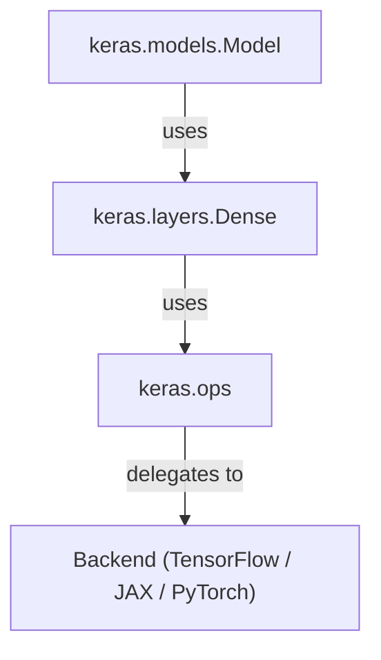

# Module View — Dependency Discovery

🎯 **Focus:** Static structure (uses relationships)

## What this shows

- Clean layered architecture
- Strict dependency direction (top → down)
- Foundation of modifiability