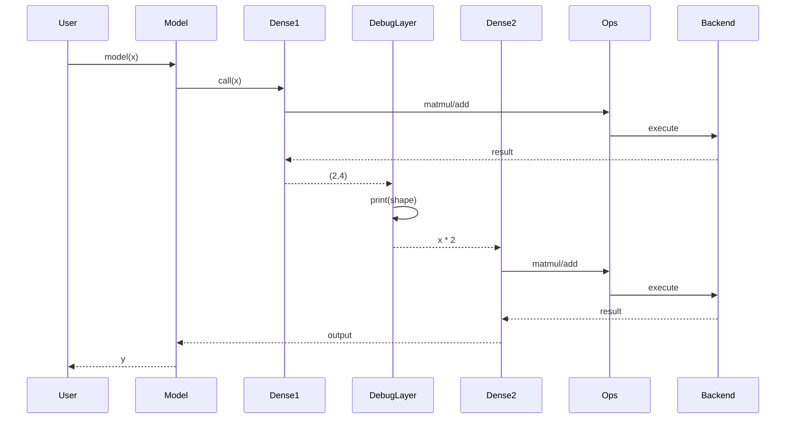

# C&C View — Forward Pass Trace

🎯 **Focus:** Runtime execution (data flow)

```mermaid
sequenceDiagram
participant User
participant Model
participant Dense1
participant DebugLayer
participant Dense2
participant Ops
participant Backend

User->>Model: model(x)
Model->>Dense1: call(x)
Dense1->>Ops: matmul/add
Ops->>Backend: execute
Backend-->>Dense1: result

Dense1-->>DebugLayer: (2,4)
DebugLayer->>DebugLayer: print(shape)
DebugLayer-->>Dense2: x * 2

Dense2->>Ops: matmul/add
Ops->>Backend: execute
Backend-->>Dense2: result

Dense2-->>Model: output
Model-->>User: y
```

## What this shows

- Pipeline execution
- Layers as components
- Calls as connectors
- Data flows sequentially