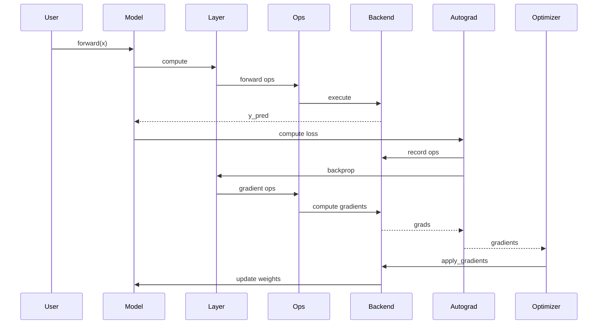

# Full Training Cycle — Gradient Flow

🎯 **Focus:** Forward + backward + update

## What this shows

- Full learning cycle
- Two directions: forward (prediction) and backward (learning)
- Optimizer as state-mutation component