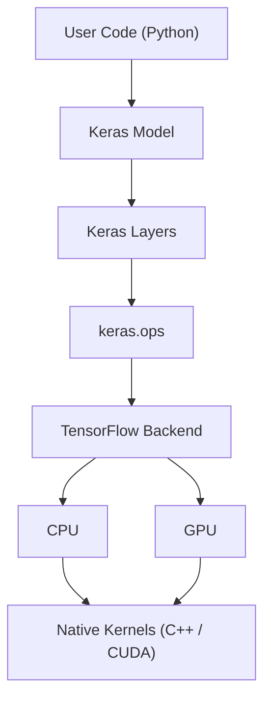

# Allocation View — Device Detection

🎯 **Focus:** Software → hardware mapping

## What this shows

- Execution is delegated downward
- Backend chooses device (CPU/GPU)
- Kernels perform real computation