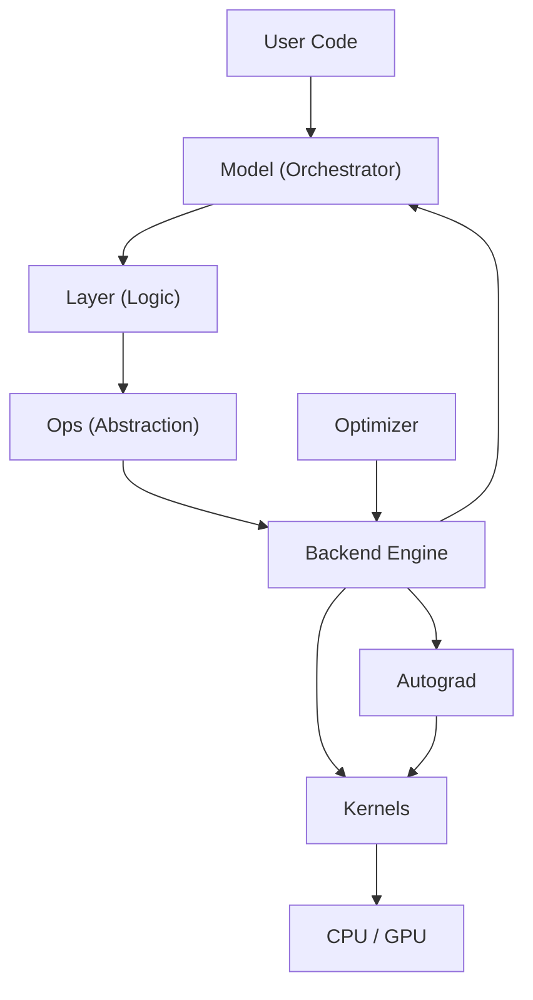

# Week 02 Diagrams

This folder contains architecture views for the Keras recovery study in Week 02.

## Files

- `1.Module View-Dependency Discovery.md`
- `2.C&C View-Forward Pass Trace.md`
- `3.Full Training Cycle-Gradient Flow.md`
- `4.Allocation View-Device Detection.md`