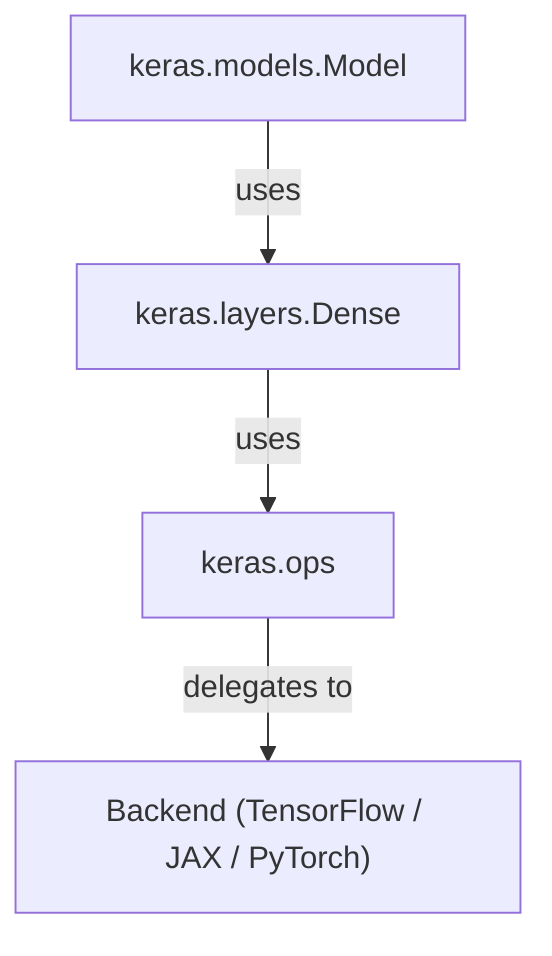
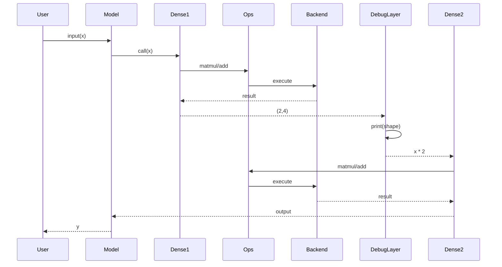
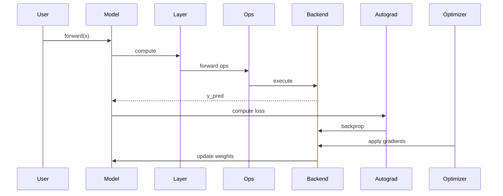
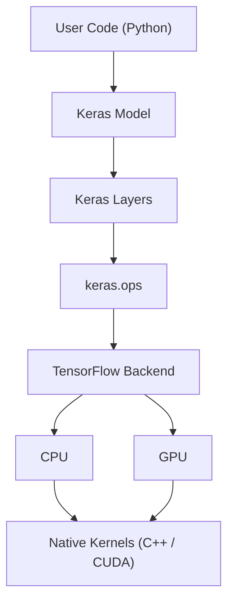

# Responsibilities, Patterns, and Findings

## 1. Architectural Analysis and Interpretation

### 1.1 Module View (Static Dependencies)

**Diagram Reference:** Experiment 1 — Module View

**Observations and Findings**

- **Layered architecture:** Clear top-to-bottom dependency flow: `Model → Layer → Ops → Backend` with no circular dependencies.
- **Responsibilities:**
  - **Model:** Orchestrator; controls forward pass and training loop.
  - **Layer:** Logic wrapper; encapsulates transformation logic.
  - **Ops:** Abstraction layer; delegates math to backend.
  - **Backend:** Computation engine; executes tensor operations.
- **Patterns:**
  - Layered pattern for separation of concerns.
  - Dependency inversion in high-level vs. low-level execution details.
  - Open/Closed principle through extensible layers and models.

**Interpretation:**
The modular design isolates high-level orchestration from low-level execution, enabling backend independence, maintainability, and flexibility.

### 1.2 C&C View (Runtime Interactions / Forward Execution)

**Diagram Reference:** Experiment 2 — Forward Pass

**Observations and Findings**

- **Runtime behavior:** Data flows sequentially through layers.
- **Responsibilities:**
  - **Model:** Orchestrates execution sequence.
  - **Layer:** Performs transformations.
  - **Ops and Backend:** Execute tensor operations.
- **Patterns:** Pipeline execution with traceability via `DebugLayer`.

**Interpretation:**
Keras runtime behaves as a component-based pipeline that supports tracing, debugging, and composability.

### 1.3 Full Gradient Flow (Backward Pass + Optimizer)

**Diagram Reference:** Experiment 3 — Gradient Flow

**Observations and Findings**

- **Responsibilities:**
  - **Autograd / GradientTape:** Records ops and computes gradients.
  - **Optimizer:** Updates weights.
  - **Backend:** Executes forward and backward operations.
  - **Model/Layer:** Define structure, not low-level numeric compute.
- **Patterns:**
  - Observer/Recorder (`GradientTape`).
  - Command-style update step (`Optimizer`).

**Interpretation:**
Forward and backward phases are decoupled, which supports custom training loops and multi-backend gradient execution.

### 1.4 Allocation View (Hardware Mapping)

**Diagram Reference:** Experiment 4 — Device Detection

**Observations and Findings**

- **Responsibilities:**
  - **Kernels:** Numeric computation.
  - **Backend:** Device dispatch.
  - **Ops/Layers:** Hardware-agnostic abstractions.
  - **Model:** Orchestrates logic and flow.
- **Patterns:** Bridge pattern (`Ops → Backend → Hardware`) and separation of concerns.

**Interpretation:**
Hardware abstraction provides portability and scalability.

## 2. Key Architectural Findings (Summary)

| Aspect | Finding | Implication |
| --- | --- | --- |
| Layering | `Model → Layer → Ops → Backend` | Clean separation, maintainable, extensible |
| C&C / Runtime | Forward + backward pipeline | Traceable, composable execution |
| Gradient Computation | GradientTape + Optimizer | Flexible training loops, backend-agnostic |
| Hardware Mapping | Allocation + device detection | Portability, scalability, performance |
| Design Patterns | Layered, Pipeline, Bridge, Observer | Modularity and backend switching |

## 3. Architectural Meaning and Responsibilities

| Component | Responsibility |
| --- | --- |
| Model | Orchestrator; defines flow, hardware-agnostic |
| Layer | Transformation component; encapsulates logic |
| Ops | Abstraction layer; delegates math to backend |
| Backend | Execution engine; manages devices and tensors |
| Autograd | Gradient recorder; computes backward pass |
| Kernels | Numeric executor; performs raw computation |
| Optimizer | Applies gradient updates; mutates model state |

**Meaning:**
Keras separates control, computation, learning, and execution to enable flexibility, portability, and scalability.

## 4. Observed Patterns and Principles

- Layered architecture (module separation)
- Pipeline pattern (runtime execution flow)
- Bridge pattern (`Ops → Backend → Hardware`)
- Observer pattern (`GradientTape` tracks computation)
- Open/Closed principle (extend layers/models without backend changes)
- Hardware abstraction (software decoupled from execution platform)

## Week 2 Takeaway

Keras is a modular, layered, and hardware-agnostic deep learning framework.

- Separation of concerns improves maintainability and extensibility.
- Component-based runtime supports debugging and flexibility.
- Allocation abstraction enables portability and performance.

## 5. References

- Bass, L., Clements, P., and Kazman, R. (2012). *Software Architecture in Practice* (3rd edition).
- Keras documentation: https://keras.io
- TensorFlow documentation: https://www.tensorflow.org
