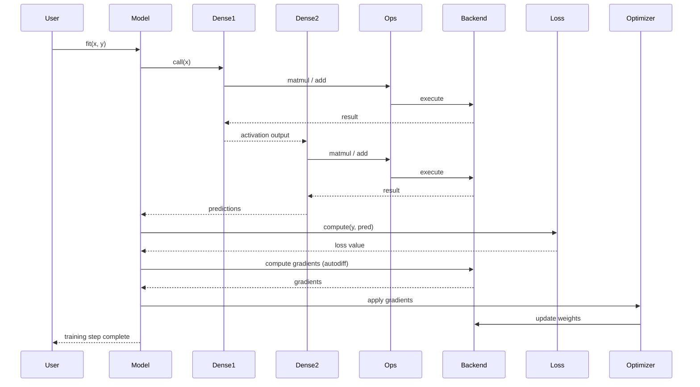

# C&C View Sequence Diagram (Training Flow)

Focus: runtime execution during training, including data flow and control flow.

## Sequence Diagram



## Interpretation

### 1) Pipeline Execution

The diagram shows one complete training cycle:
- Forward pass to generate predictions
- Loss computation to evaluate error
- Backward pass to compute gradients
- Update step to adjust weights

This confirms that training is a repeated runtime interaction loop.

### 2) Components as Runtime Units

Each participant is a C&C component:
- `Model`: orchestrator
- `Dense` layers: transformation units
- `Loss`: evaluation component
- `Optimizer`: update mechanism
- `Backend`: execution engine

These components collaborate to complete one training step.

### 3) Connectors as Interactions

Arrows represent connectors such as:
- Function calls (`call`, `compute`)
- Delegation (`ops -> backend`)
- Data flow (tensors, gradients)

Connectors define how computation propagates through the system.

### 4) Backend Delegation

Numerical operations follow this path:

```text
Layer -> Ops -> Backend -> Hardware
```

Architectural principle:

> Keras defines computation, but the backend executes it.

### 5) Separation of Concerns

| Phase | Responsible Component |
| --- | --- |
| Forward pass | Layers + Backend |
| Loss computation | Loss |
| Backward pass | Backend |
| Weight update | Optimizer |

This separation improves modularity and maintainability.

### 6) Control vs Execution

- Control flow is managed by the `Model`.
- Execution is performed by the `Backend`.

This design enables multi-backend support, performance optimization, and clean abstraction boundaries.

## Key Insight

> The Keras training process is a structured sequence of interactions where the model orchestrates components and the backend performs computation.

## Architectural Value

This sequence diagram helps you:
- Understand runtime behavior
- Trace data and control flow
- Identify component responsibilities
- Reason about performance and extensibility

It is a core artifact for recovering the C&C architecture of Keras.
