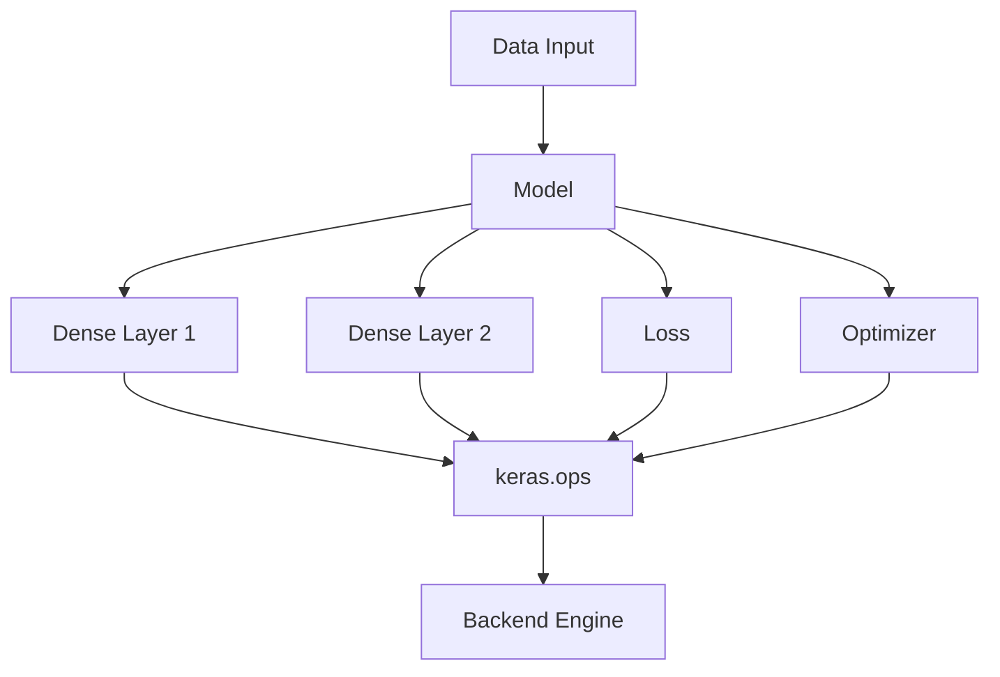

# C&C View - Component Diagram (Runtime Structure)

Focus: System structure at runtime (components and relationships).

## Component Diagram



## Interpretation

### 1. Structural View of the Runtime System

This diagram represents the static structure of runtime components, answering:

> What elements exist and how are they connected?

Unlike the sequence diagram, it does not show execution order, only relationships.

### 2. Central Role of the Model

The `Model` acts as the central coordinator, connecting to:

- Layers (Dense1, Dense2)
- Loss function
- Optimizer

This confirms:

> The Model is the control hub of the training process.

### 3. Layers as Computation Definitions

- `Dense1` and `Dense2` define transformations.
- They do not execute computation directly.

Instead:

```text
Layer -> ops -> backend
```

This shows delegation of execution.

### 4. Backend Isolation via `keras.ops`

All computation-related components depend on:

- `keras.ops` (abstraction layer)
- `Backend` (execution engine)

This enforces:

> No component directly depends on TensorFlow, JAX, or PyTorch.

### 5. Shared Dependency on Backend

The following components all rely on backend execution:

- Layers
- Loss
- Optimizer

This highlights:

- A shared computation infrastructure
- Centralized execution logic

### 6. Separation of Concerns

| Responsibility | Component |
| --- | --- |
| Orchestration | Model |
| Transformation | Layers |
| Error computation | Loss |
| Parameter updates | Optimizer |
| Computation | Backend |

This separation improves:

- Modularity
- Maintainability
- Extensibility

### 7. Dependency Direction (Very Important)

All dependencies follow:

```text
High-level -> Low-level
```

```text
Model -> Layer -> Ops -> Backend
```

Not:

```text
Backend -> Layer -> Model
```

This ensures stable architecture.

## Key Insight

> The Keras architecture is organized around a central Model that coordinates multiple components, while all computation is funneled through a backend abstraction layer.

## Architectural Value

This component diagram allows us to:

- Identify system components
- Understand dependency relationships
- Analyze modularity and flexibility
- Explain backend independence

It complements the sequence diagram by showing structure instead of behavior.

## Final Connection (C&C Pair)

| View | Purpose |
| --- | --- |
| Sequence Diagram | Shows runtime behavior (flow) |
| Component Diagram | Shows system structure (relationships) |

Together, they provide a complete C&C understanding of Keras.
