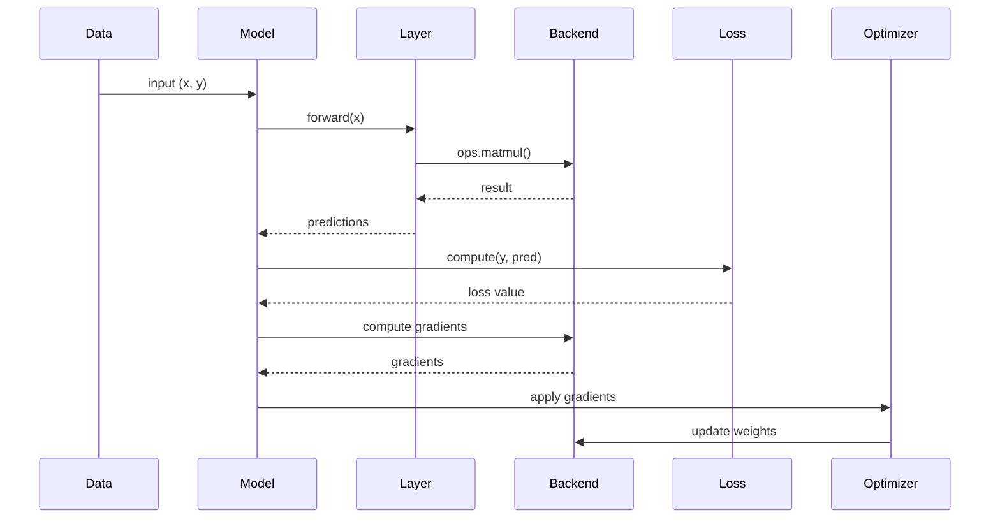
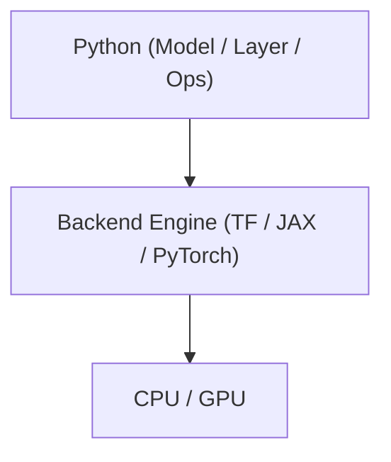

# Keras Architecture Recovery Reading Note

Week 3/10

## Goal

Understand how software behaves at runtime, why architecture matters, and how execution maps to real systems by using Keras as a concrete case.

Focus areas:
- C&C structures (runtime behavior)
- Why architecture matters (communication and reasoning)
- Allocation structures (execution environment)

## 1) C&C Structures (Runtime View)

### Intuition

This view is not "who depends on who". It is "who interacts with who while the system is running".

### Components and Connectors

Components are runtime units that perform computation, such as:
- Model
- Layer
- Loss
- Optimizer
- Backend (ops)

Connectors are runtime interactions between components, such as:
- Function calls (`model(x)`, `layer.call()`)
- Tensor data flow
- Gradient propagation

### Runtime Interaction Pattern

```text
Input -> Process -> Output
```

Keras training flow:

```text
Input -> Forward -> Loss -> Backward -> Update
```

### C&C Sequence Diagram



Key insight:
- C&C structures describe runtime execution.
- Connectors define data flow, control flow, and execution order.

## 2) C&C Component Structure (Static Runtime View)

### Intuition

Instead of asking "when things happen", this view asks "what components exist and how are they connected".

### Component Diagram

```mermaid
graph TD
    Data[Data Input]

    Model[Model]
    Layer[Layer]
    Loss[Loss]
    Optimizer[Optimizer]
    Backend[Backend (ops)]

    Data --> Model

    Model --> Layer
    Model --> Loss
    Model --> Optimizer

    Layer --> Backend
    Loss --> Backend
    Optimizer --> Backend
```

Architectural insights:
- Model is the central orchestrator.
- Computation is delegated to the backend.
- Layers define logic but do not execute low-level math directly.
- Backend isolates implementation details.

## 3) Why Architecture Matters

### Core Roles

1. Communication
- Creates shared understanding.
- Aligns developers and stakeholders.

2. Reasoning
- Enables analysis of performance, scalability, and modifiability.

3. Constraints
- Defines what is allowed and what is restricted.

### Keras Multi-backend Rule

Keras enforces:

```text
Layer -> ops -> backend
```

Not:

```text
Layer -> TensorFlow directly
```

Benefits:
- Portability across TensorFlow, JAX, and PyTorch.
- Modifiability through clear abstraction boundaries.
- Performance flexibility through backend-specific optimization.

Key insight:

> Architecture separates control (Keras) from execution (backend).

## 4) Allocation Structures (Real-world View)

### Intuition

This view answers: where does each part actually run?

Allocation maps software elements to hardware and runtime environments.

### Keras Allocation Table

| Software Element | Runs On |
| --- | --- |
| Model/Layer | Python (CPU orchestration) |
| keras.ops | Python to backend bridge |
| Backend (TF/JAX/PT) | Native runtime (C++/XLA) |
| Tensor operations | CPU or GPU |

### Allocation Diagram



Why allocation matters:
- Performance: CPU is generally slower than GPU for deep learning workloads.
- Scalability: correct allocation reduces bottlenecks.

Key insight:
- Python orchestrates.
- Backend executes.
- Hardware computes.

## 5) Required Extractions

What is a connector in Keras?
- A runtime interaction, such as function calls or tensor flow between components (for example, Model -> Layer -> Backend).

What happens during a forward pass?
- Input flows through Model -> Layer -> Backend and produces predictions.

Which part runs on GPU?
- The backend execution engine runs GPU computations.

Why can Keras switch backends?
- Because computations are routed through `keras.ops`, which abstracts backend details.

## 6) Summary of Keras Architectural View

Model:
- Central orchestrator.
- Coordinates training flow.

Layer:
- Defines transformations.
- Entry point is `call()`.

Backend (ops):
- Executes numerical computation.
- Interfaces with hardware runtimes.

Training pipeline:

```text
Forward -> Loss -> Backward -> Update
```

Final insight:

> Keras architecture separates orchestration from execution, enabling flexibility, portability, and scalability.
