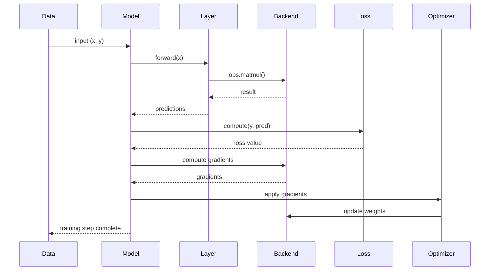
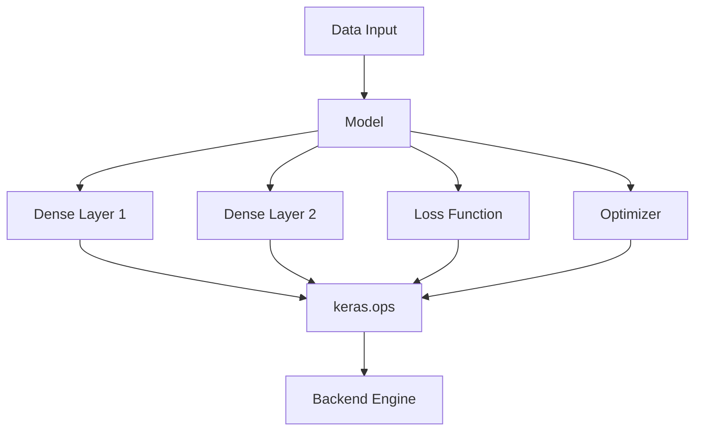

# Responsibilities, Patterns, and Findings - Keras Architecture Recovery

Week 3/10

## 1. Architectural Analysis and Interpretation

This section analyzes the runtime and structural behavior of Keras using Component-and-Connector (C&C), module relationships, and allocation mapping.

## 1.1 Component-and-Connector View (Training Runtime)

### Focus

Runtime execution of training:

```text
Forward pass -> Loss -> Backward pass -> Update
```

### Sequence Diagram (Training Flow)



### Observations and Findings

- Training is a structured runtime pipeline, not a single function call.
- Execution is split into four phases:
  1. Forward pass
  2. Loss computation
  3. Backward pass (autodiff)
  4. Weight update
- Backend is responsible for both forward and backward computation.

### Responsibilities

| Component | Responsibility |
| --- | --- |
| Model | Orchestrates full training lifecycle |
| Layer | Performs transformations on data |
| Loss | Computes prediction error |
| Optimizer | Applies gradient updates |
| Backend | Executes tensor operations and autodiff |

### Patterns Identified

- Pipeline Pattern: sequential transformation of data
- Command Pattern: optimizer applies update commands
- Separation of Concerns: training split into distinct phases
- Backend Delegation Pattern: all computation routed to backend

### Interpretation

Keras training behaves as a component-based execution pipeline where the model coordinates specialized components while delegating computation to a backend engine.

## 1.2 Component Structure (Runtime Architecture)

### Focus

Static runtime structure: what components exist and how they are connected.

### Component Diagram



### Observations and Findings

- Model acts as the central coordination unit.
- Layers are pure transformation components.
- `keras.ops` acts as a unified abstraction layer.
- Backend is the only execution engine.

### Responsibilities

| Component | Responsibility |
| --- | --- |
| Model | Central orchestrator |
| Layers | Define transformations |
| Ops | Abstraction layer for computation |
| Loss | Evaluation logic |
| Optimizer | Parameter update logic |
| Backend | Executes all numerical computation |

### Patterns Identified

- Layered Architecture Pattern
- Dependency Inversion Principle
- Bridge Pattern (Ops -> Backend)
- Modular Decomposition

### Interpretation

The system is designed so that high-level logic never depends directly on low-level computation engines, ensuring backend independence and extensibility.

## 1.3 Allocation View (Execution Mapping)

### Focus

Mapping software components to runtime environment and hardware.

### Observations and Findings

Keras execution is distributed across three layers:

1. Python Layer
   - Model, layers, training loop
   - Orchestration logic
2. Backend Layer
   - Tensor operations
   - Autodiff (gradient computation)
3. Hardware Layer
   - CPU/GPU execution
   - Native kernel execution (C++/CUDA/XLA)

### Responsibilities

| Layer | Responsibility |
| --- | --- |
| Python | Control flow and orchestration |
| Backend | Computation engine |
| Hardware | Physical execution of operations |

### Patterns Identified

- Bridge Pattern (Python -> Backend -> Hardware)
- Hardware Abstraction Pattern
- Execution Offloading Pattern

### Interpretation

Keras separates control, computation, and execution environments, allowing the same code to run across different hardware and backend systems without modification.

## 2. Key Architectural Findings (Summary)

| Aspect | Finding | Architectural Impact |
| --- | --- | --- |
| Training Flow | Pipeline-based execution | Clear runtime structure |
| Backend Design | Fully delegated computation | Backend independence |
| Component Design | Modular and layered | High maintainability |
| Allocation | Multi-layer execution model | Portability and scalability |
| Gradient Flow | Autodiff-based execution | Enables custom training loops |

## 3. Responsibilities Mapping

| Component | Core Responsibility |
| --- | --- |
| Model | Orchestrates training and inference |
| Layer | Encapsulates transformation logic |
| Loss | Measures prediction error |
| Optimizer | Updates model parameters |
| Ops | Abstract computation interface |
| Backend | Executes tensor math and gradients |
| Hardware | Runs optimized kernels |

## 4. Global Architectural Interpretation

Keras is structured as a multi-layered, backend-agnostic deep learning framework where:

- The model controls execution flow
- The layers define computation logic
- The backend performs all numerical operations
- The hardware executes optimized kernels

This separation enables:

- High modularity
- Backend portability (TensorFlow/JAX/PyTorch)
- Efficient hardware utilization
- Clear runtime structure

## 5. Final Insight (Week 3 Core Understanding)

> Keras architecture is built on a strict separation between orchestration (Python), computation (backend), and execution (hardware), enabling a flexible and highly modular deep learning system.
