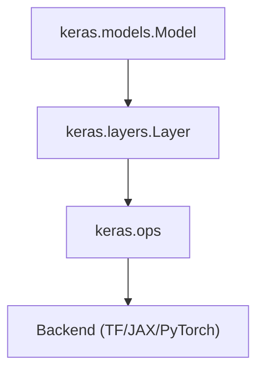

# Module View - Static Structure

Focus: static module dependencies and layered responsibility boundaries.

## Module Diagram



## Interpretation

### 1. Layered Dependency Structure

This diagram shows a strict top-down dependency chain:

```text
Model -> Layer -> Ops -> Backend
```

Each level depends only on the one below it, which supports stable modular design.

### 2. Responsibility Separation

| Layer | Responsibility |
| --- | --- |
| Model | Orchestrates training and workflow |
| Layer | Defines reusable computation units |
| Ops | Abstracts mathematical operations |
| Backend | Executes hardware-aware computation |

This separation prevents responsibility overlap between abstraction levels.

### 3. Information Hiding Through Indirection

Important architecture properties:
- Model does not know backend implementation details
- Layer does not directly implement low-level backend math
- Ops decouples public API logic from backend execution

This is a direct use of separation of concerns and information hiding tactics.

## Key Insight

> Keras uses layered indirection to isolate responsibilities, enabling independent evolution of model API, layer logic, and backend execution.

## Architectural Value

This module view helps you:
- Understand static dependency direction
- Evaluate coupling between abstraction levels
- Explain why Keras can support multiple backends without changing user model code