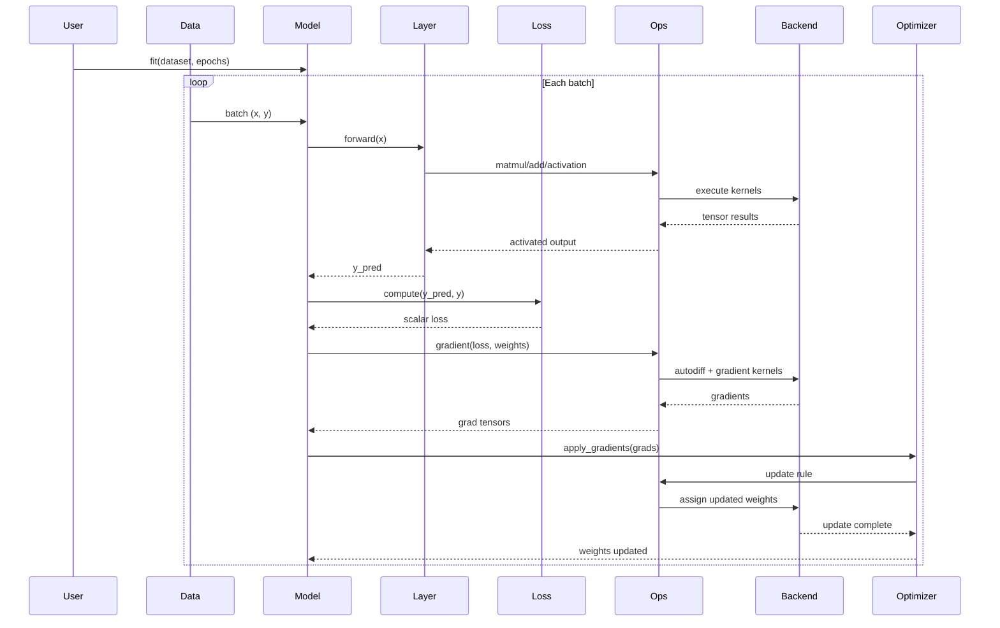

# Component-and-Connector (Runtime) Flow

Focus: runtime interactions among training components, showing control flow and data flow during one training iteration.

## Runtime Flow Diagram



## Interpretation

### 1. Runtime Pipeline Structure

This diagram shows a repeated runtime training cycle:
- Batch enters through `Data -> Model`
- Forward computation flows through `Layer -> Ops -> Backend`
- Loss and gradients are computed through `Loss` and `Ops`
- Parameters are updated through `Optimizer -> Ops -> Backend`

The cycle is iterative and stateful, because each update changes model weights.

### 2. Forward and Return Paths

Forward data path:

```text
Data -> Model -> Layer -> Ops -> Backend
```

Return path (intermediate outputs):

```text
Backend -> Ops -> Layer -> Model
```

Update path:

```text
Model -> Loss -> Ops -> Backend -> Ops -> Optimizer -> Ops -> Backend
```

These paths capture how tensors move through the runtime architecture.

### 3. Connectors and Responsibilities

Connectors in this view are runtime interactions such as:
- Function calls (`fit`, `forward`, `compute`, `apply_gradients`)
- Delegation (`ops -> backend`)
- Returned tensors (activations, gradients, updated weights)

Responsibilities:
- `Model`: orchestration and control
- `Layer`: transformation logic
- `Loss`: error computation
- `Ops`: operation abstraction
- `Backend`: numerical execution
- `Optimizer`: parameter update

### 4. Control Loop Perspective

Learning loop:

```text
Forward pass -> Loss -> Gradients -> Weight update -> Next batch
```

This matches a feedback-oriented training system where model parameters are adapted over repeated iterations.

## Key Insight

> Keras runtime behavior is a connector-driven training loop where orchestration stays in `Model`, while numerical work is delegated through `keras.ops` to the backend engine.

## Architectural Value

This runtime sequence view helps you:
- Trace end-to-end training interactions at runtime
- Identify where each connector carries activations, gradients, and updates
- Explain how backend independence is preserved through `keras.ops`