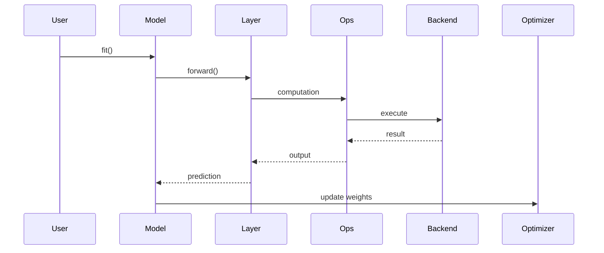

# C&C View Sequence Diagram (Runtime Training Flow)

Focus: runtime behavior during training, including data flow and control flow.

## Sequence Diagram



## Interpretation

### 1. Runtime Pipeline Structure

This diagram shows a runtime pipeline with a repeated update loop:
- Forward computation through Layer, Ops, and Backend
- Result propagation back to the Model
- Weight update through the Optimizer

The training step is therefore iterative and stateful.

### 2. Forward and Return Paths

Forward path (data flow):

```text
User -> Model -> Layer -> Ops -> Backend
```

Return path (results):

```text
Backend -> Ops -> Layer -> Model
```

These paths capture how tensors move through the runtime architecture.

### 3. Connectors and Responsibilities

Connectors in this sequence are runtime interactions such as:
- Function calls (`fit`, `forward`)
- Delegation (`ops -> backend`)
- Returned computation outputs

Responsibilities:
- `Model`: orchestration and control
- `Layer`: transformation definition
- `Ops`: operation abstraction
- `Backend`: numerical execution
- `Optimizer`: parameter update

### 4. Control Loop Perspective

Learning loop:

```text
Forward pass -> Prediction -> Weight update -> Next pass
```

This matches a feedback-oriented training system where model parameters are adapted over repeated iterations.

## Key Insight

> Keras training is a structured runtime loop where the model orchestrates component interactions and backend execution is delegated through `keras.ops`.

## Architectural Value

This runtime sequence view helps you:
- Trace control and data flow during training
- Identify where execution is delegated
- Explain how Keras maintains backend independence while preserving a stable API