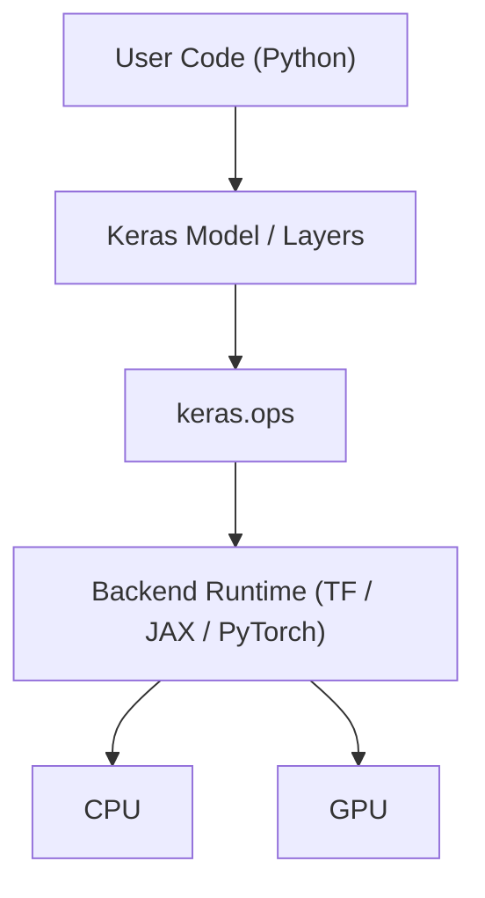

# Allocation View - Execution Mapping

Focus: mapping Keras software elements to runtime engines and hardware resources.

## Allocation Mapping

| Element | Runs Where |
| --- | --- |
| Model / Layer | Python runtime (control and orchestration) |
| Ops | Abstraction boundary (`keras.ops`) with backend dispatch |
| Backend | TensorFlow / JAX / PyTorch runtime |
| Execution | CPU / GPU kernels |

## Allocation Diagram

## Interpretation

### 1. Control vs Execution Split

Keras high-level API elements (`Model`, `Layer`) control workflow in Python, while numerical execution is delegated to the backend runtime.

### 2. Backend as Allocation Boundary

`keras.ops` and the active backend form the boundary between architecture-level orchestration and hardware-level computation.

### 3. Why This Matters

This mapping explains:
- GPU acceleration behavior
- Backend switching (TF, JAX, PyTorch)
- Performance differences across devices and runtimes

## Key Insight

> Only the backend runtime directly interacts with CPU/GPU execution paths; higher Keras layers remain hardware-agnostic orchestration logic.

## Architectural Value

This allocation view helps you:
- Explain where each part of Keras actually runs
- Separate software responsibility from hardware execution
- Reason about performance and deployment portability