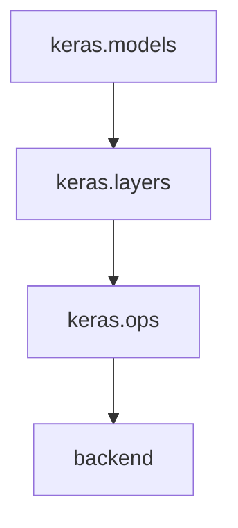
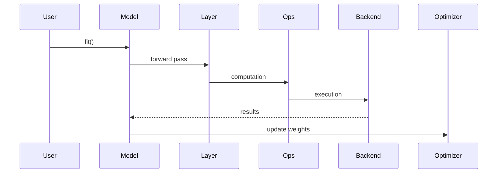

# Keras Architecture Recovery Reading Note

Week 4/10

## Goal

Understand how architecture should be represented, documented, and evolved by applying multi-view analysis and modifiability tactics to Keras.

Focus areas:
- Multi-view architecture (Module, C&C, Allocation)
- Architecture documentation quality
- Modifiability tactics in Keras

## 1. Reading Focus and Week 4 Objectives

This week focuses on how architecture is communicated to stakeholders and how design choices support long-term system evolution.

Core objectives:
- Explain why architecture needs multiple views
- Define what makes an architectural view complete
- Document Keras architecture using stakeholder-oriented views
- Analyze modifiability tactics and quality attribute impact

## 2. Core Questions and Answers

### Q1: Why does architecture require multiple views?

A single diagram cannot represent all concerns in a complex system. Architecture is a set of complementary structures.

Three fundamental structures:

| Structure | Purpose | Keras Example |
| --- | --- | --- |
| Module View | Code organization | `layers`, `models`, `ops` |
| C&C View | Runtime behavior | `fit()` training interactions |
| Allocation View | Execution environment | Backend to CPU/GPU mapping |

Key insight:
- Module view supports modifiability reasoning
- C&C view supports runtime and performance reasoning
- Allocation view supports deployment and infrastructure reasoning

### Q2: What makes a good architectural view?

A complete architectural view must include:
- Elements (modules or components)
- Relationships (dependencies or interactions)
- Behavior (how interactions unfold)

Important insight:
- A box-and-line diagram without behavior is incomplete.

Incomplete representation:

```text
Model -> Layer -> Backend
```

Complete representation:

```text
model.fit()
 -> forward pass
 -> loss computation
 -> gradient computation
 -> optimizer update
```

### Q3: How should architecture be documented?

Architecture documentation should:
1. Use multiple views
2. Be stakeholder-oriented
3. Include design rationale

Stakeholder mapping:
- Developers: module structure and dependencies
- ML engineers: runtime training and inference flow
- DevOps/infrastructure: allocation to backend and hardware

Rationale requirement:
- Document not only what the architecture is, but why it supports target quality attributes.

### Q4: What is modifiability and why is it critical in Keras?

Definition:
- Modifiability is the ease of implementing change with minimal ripple effects.

Why it matters in Keras:
- Adding layers
- Supporting new backends
- Extending training behavior
- Adapting to new hardware targets

Keras tactics supporting modifiability:

| Tactic | Description | Keras Example |
| --- | --- | --- |
| Separation of concerns | Split responsibilities | Layers vs backend vs training control |
| Information hiding | Hide implementation details | `Dense()` abstracts internal math |
| Indirection | Introduce abstraction layer | `keras.ops` routes to active backend |
| Loose coupling | Reduce direct dependencies | Model code not hard-wired to one backend |

Critical insight:
- Keras multi-backend design is a concrete application of modifiability tactics.

## 3. Structures Applied to Keras

### 3.1 Module View (Static Structure)



Interpretation:
- Layered dependency direction
- Clear subsystem responsibilities
- Independent evolution of subsystems

### 3.2 C&C View (Runtime Behavior)



Interpretation:
- Pipeline plus feedback update loop
- Explicit runtime interaction order
- Better basis for performance reasoning

### 3.3 Allocation View (Execution Mapping)

| Layer | Execution Context |
| --- | --- |
| Keras API | Python orchestration |
| `keras.ops` | Backend abstraction boundary |
| Backend | TensorFlow / JAX / PyTorch runtime |
| Execution | CPU / GPU hardware |

Interpretation:
- API logic is decoupled from hardware execution
- Portability across environments is preserved

## 4. Modifiability Analysis

### 4.1 Core Design Pattern

```text
User Code
   -> Model / Layer
   -> keras.ops (abstraction)
   -> Backend (TF / JAX / PyTorch)
   -> Hardware (CPU / GPU)
```

### 4.2 Why This Works

- Backend changes do not require rewriting model code
- New layers can be added without backend redesign
- Training algorithm changes are isolated from low-level execution

Architectural interpretation:
- Low coupling and high cohesion

### 4.3 Quality Attribute Impact

| Design Choice | Quality Attribute Impact |
| --- | --- |
| Backend abstraction | Portability |
| Modular layer system | Reusability |
| Training loop separation | Testability |
| Ops indirection | Replaceability |

## 5. Week 4 Key Insights

- Architecture is multi-dimensional and cannot be captured by one diagram.
- Documentation quality depends on complete, stakeholder-oriented views.
- Behavior is required for valid architectural reasoning, not only static boxes.
- Keras demonstrates textbook modifiability tactics through multi-backend abstraction.